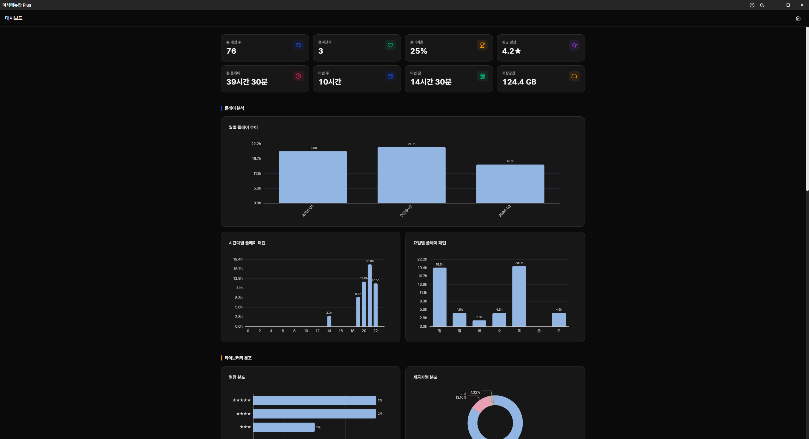

<div align="center">


# 야식메뉴판 Plus

**나만의 게임 메뉴판, 기분 따라 골라보세요**

[](https://github.com/qqoro/yasig-menu-plus/releases)
[](https://github.com/qqoro/yasig-menu-plus/releases)
[](LICENSE)




</div>

---

## 핵심 기능

- 🖼️ **이미지로 한눈에** - 썸네일 갤러리로 게임을 바로 인식
- 🔍 **찾고 싶은 게 바로** - 고급 검색, 태그/필터, 랜덤 선택
- ✨ **정보 자동 수집** - Steam, DLSite, Getchu에서 썸네일·메타데이터
- ⭐ **나만의 정리** - 별점, 태그, 즐겨찾기, 플레이 시간

## 지원 콜렉터

게임 정보를 자동으로 수집하는 콜렉터 목록입니다:

| 콜렉터   | 설명                                     | 인식 접두어           |
| -------- | ---------------------------------------- | --------------------- |
| Steam    | Steam 스토어에서 썸네일·메타데이터 수집  | `ST` + 숫자           |
| DLSite   | DLSite에서 썸네일·메타데이터 수집        | `RJ`, `BJ`, `VJ` + 숫자 |
| Getchu   | Getchu에서 썸네일·메타데이터 수집        | `GC`, `GETCHU` + 숫자 |
| Ci-en    | Ci-en에서 썸네일·메타데이터 수집         | `CE`, `CIEN`, `CI-EN` |
| Google   | Google 이미지 검색으로 썸네일 수집       | (폴더명으로 검색)     |

## 왜 야식메뉴판 Plus인가?

- **이미지 중심** - 텍스트 목록이 아닌, 썸네일로 어떤 게임인지 바로 알아봐요
- **동인 게임에 최적화** - Steam, DLSite, Getchu 등에서 정보를 바로 가져와요
- **가볍고 단순하게** - 복잡한 설정 없이 폴더만 지정하면 바로 시작

## 설치

[릴리즈 페이지](https://github.com/qqoro/yasig-menu-plus/releases)에서 최신 버전을 다운로드하세요.

| 배포판     | 파일명                                | 설명             |
| ---------- | ------------------------------------- | ---------------- |
| 인스톨러   | `yasig-menu-plus-setup-x.x.x.exe`     | Windows에 설치   |
| 포터블     | `yasig-menu-plus-portable-x.x.x.exe`  | 설치 없이 실행   |

## 개발

### 환경 요구사항

- Node.js 18+
- pnpm (필수)

### 명령어

```bash
pnpm install       # 의존성 설치
pnpm dev           # 개발 서버 실행
pnpm build         # Windows 인스톨러 빌드
pnpm build:port    # Windows 포터블 빌드
pnpm lint          # 린트 검사
pnpm format        # 코드 포맷팅
pnpm type-check    # 타입 검사
```

## 라이선스

이 프로젝트는 [MIT](LICENSE) 라이선스 하에 배포됩니다.
