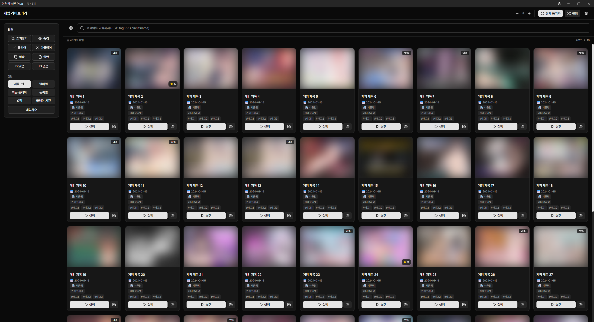

<div align="center">


# 야식메뉴판 Plus

**흩어진 게임을 한 곳에, 체계적인 라이브러리 관리**

[](https://github.com/qqoro/yasig-menu-plus/releases)
[](https://github.com/qqoro/yasig-menu-plus/releases)
[](LICENSE)



</div>

---

## 소개

여러 폴더에 흩어진 게임들을 자동으로 스캔하여 **하나의 라이브러리**에서 관리할 수 있는 데스크톱 애플리케이션입니다.
Steam, DLSite, Getchu 등 다양한 플랫폼에서 썸네일과 정보를 자동으로 수집하고, 태그·평점·플레이 시간 등을 기록하여 나만의 게임 라이브러리를 완성하세요.

## 주요 기능

### 라이브러리

- **자동 스캔** - 폴더와 압축파일을 자동으로 감지, 앱 시작 시 변경사항 반영
- **다중 경로** - 여러 폴더를 라이브러리로 등록하여 통합 관리
- **실행 파일 관리** - 게임별 실행 파일 지정 또는 제외 설정

### 검색

- `Ctrl+F`로 즉시 검색
- 고급 검색 문법 (`provider:dlsite`, `tag:RPG`, `circle:서클명`)
- 한글/영문 prefix 지원 (`태그:`, `tag:`)
- 태그, 서클, 카테고리 자동완성
- 필터: 즐겨찾기, 숨김, 클리어, 압축파일, 외부 ID 유무
- 정렬: 제목, 발매일, 플레이 시간, 별점, 추가일
- 랜덤 게임 선택

### 정보 수집

- Steam, DLSite, Getchu, Cien, Google에서 썸네일·메타데이터 자동 수집
- 일괄 수집 및 Google Fallback 지원
- URL 또는 로컬 파일로 썸네일 직접 설정
- 추가 이미지 등록 (갤러리)
- 원본 사이트 바로가기

### 게임 관리

- 별점 (1~5점), 태그, 카테고리, 제작사
- 즐겨찾기, 숨김, 클리어 표시
- 제목 번역 (Google 번역)
- 개인 메모

### 플레이 타임

- 실행 시간 자동 추적 (.exe)
- 세션별 기록 및 마지막 플레이 시간

### 테마

- 컬러 테마 및 다크 모드 지원

## 설치

[릴리즈 페이지](https://github.com/qqoro/yasig-menu-plus/releases)에서 최신 버전을 다운로드하세요.

| 배포판     | 파일명                                | 설명             |
| ---------- | ------------------------------------- | ---------------- |
| 인스톨러   | `yasig-menu-plus-setup-x.x.x.exe`     | Windows에 설치   |
| 포터블     | `yasig-menu-plus-portable-x.x.x.exe`  | 설치 없이 실행   |

## 개발

### 환경 요구사항

- Node.js 18+
- pnpm (필수)

### 명령어

```bash
pnpm install       # 의존성 설치
pnpm dev           # 개발 서버 실행
pnpm build         # Windows 인스톨러 빌드
pnpm build:port    # Windows 포터블 빌드
pnpm lint          # 린트 검사
pnpm format        # 코드 포맷팅
pnpm type-check    # 타입 검사
```

## 라이선스

이 프로젝트는 [MIT](LICENSE) 라이선스 하에 배포됩니다.
